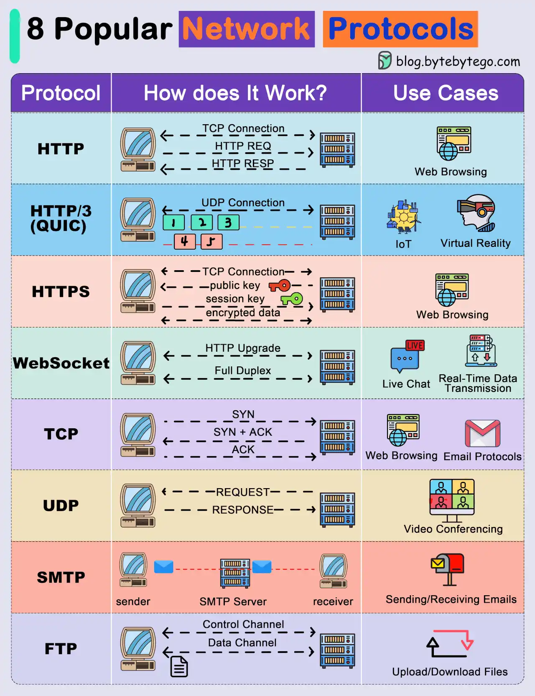

### Network Protocols:

**Networking** refers to the process of connecting devices (computers, phones, servers) to share resources, exchange data, and communicate.

| **Protocol** | **Purpose**                                                                                                                                                | **Encryption** | **Example**                       |
| ------------ | ---------------------------------------------------------------------------------------------------------------------------------------------------------- | -------------- | --------------------------------- |
| **FTP**      | `File Transfer Protocol`, used for transferring files between a client and server over a network.                                                          | No             | `ftp://example.com`               |
| **SFTP**     | `Secure File Transfer Protocol`, a secure version of FTP, encrypting both commands and data. It runs over SSH.                                             | Yes            | `sftp://example.com`              |
| **HTTP**     | `Hypertext Transfer Protocol`, used for transferring data between a web browser and a web server. Typically used for websites.                             | No             | `http://example.com`              |
| **HTTPS**    | `Hypertext Transfer Protocol Secure`, a secure version of HTTP, using encryption (SSL/TLS) for data transfer, ensuring security and privacy.               | Yes            | `https://example.com`             |
| **SSL**      | `Secure Sockets Layer`, a protocol for encrypting information. It was widely used for securing connections but is now replaced by TLS.                     | Yes            | Replaced by TLS in modern systems |
| **TLS**      | `Transport Layer Security`, the successor to SSL, used to secure communication over networks. It is commonly used with HTTPS for secure browsing.          | Yes            | Commonly used by HTTPS            |
| **DNS**      | `Domain Name System`, resolves human-readable domain names (e.g., `example.com`) to IP addresses, allowing the browser to locate servers.                  | No             | `nslookup example.com`            |
| **SSH**      | `Secure Shell`, a protocol used for securely accessing remote computers and systems over a network. It encrypts the connection to protect against attacks. | Yes            | `ssh user@example.com`            |

### REST APIs ( Representational State Transfer)

REST API is an architectural style for designing networked applications. It's a lightweight, flexible, and scalable way to communicate between systems, allowing data exchange and manipulation.

-   **HTTP Methods:**

    -   GET (Retrieve resource)
    -   POST (Create resource)
    -   PUT (Update resource)
    -   DELETE (Delete resource)
    -   PATCH (Partial update resource)

-   **REST API Components:**

    -   `Resource`: Identified by URI (Uniform Resource Identifier)
    -   `Request`: Client sends HTTP request to server
    -   `Response`: Server sends HTTP response to client
    -   `Header`: Metadata about request/response (e.g., authentication, content type)
    -   `Body`: Payload of request/response (e.g., JSON data)

-   **REST API Status Codes:**
    -   `200` OK (successful request)
    -   `404` Not Found (resource not found)
    -   `401` Unauthorized (authentication failed)
    -   `500` Internal Server Error (server error)

### GraphQL (Graph Query Language)

`GraphQL` is a query language for APIs (Application Programming Interfaces) that allows clients to specify exactly what data they need, reducing overhead and improving performance.

-   **Key Features:**

    -   Declarative queries
    -   Strong typing
    -   Schema-driven development
    -   Query optimization
    -   Real-time updates

-   **GraphQL Query Components:**
    -   Fields (specific data)
    -   Types (data types)
    -   Resolvers (functions retrieving data)
    -   Queries (fetching data)
    -   Mutations (modifying data)
    -   Subscriptions (real-time updates)

### GraphQL vs. REST:

|                   | GraphQL          | REST                                     |
| ----------------- | ---------------- | ---------------------------------------- |
| Query structure   | Declarative      | Imperative                               |
| Data retrieval    | Specific fields  | Entire resource                          |
| API endpoints     | Single endpoint  | Multiple endpoints                       |
| Data types        | Strongly typed   | Weakly typed                             |
| Real-time updates | Native support   | WebSockets or polling                    |
| Performance       | Fast             | Multiple network calls take up more time |
| Web caching       | Uses web library | Inbuilt                                  |
| File uploading    | No               | Yes                                      |
